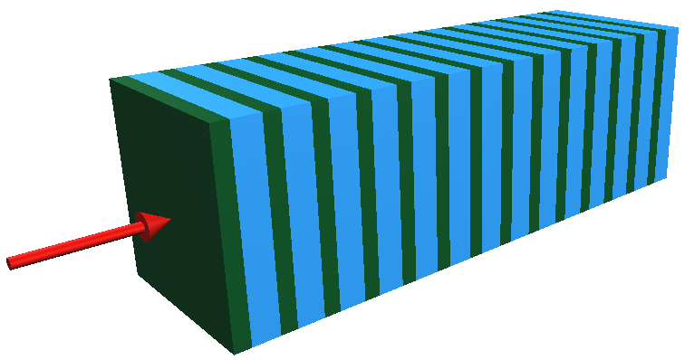
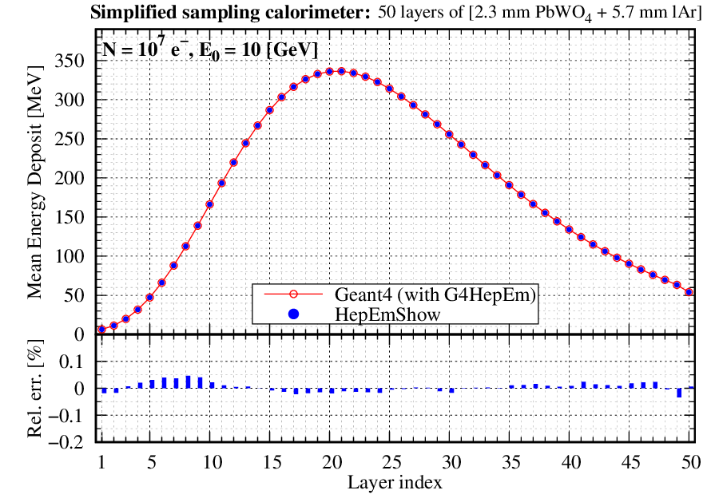
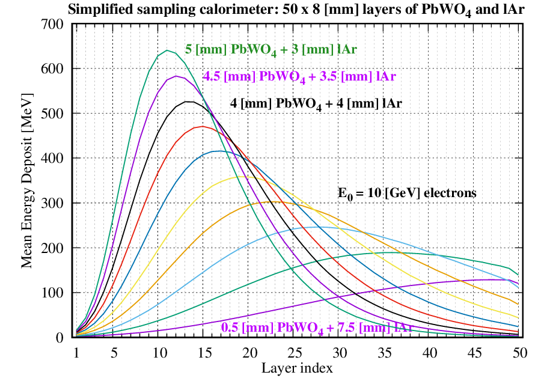
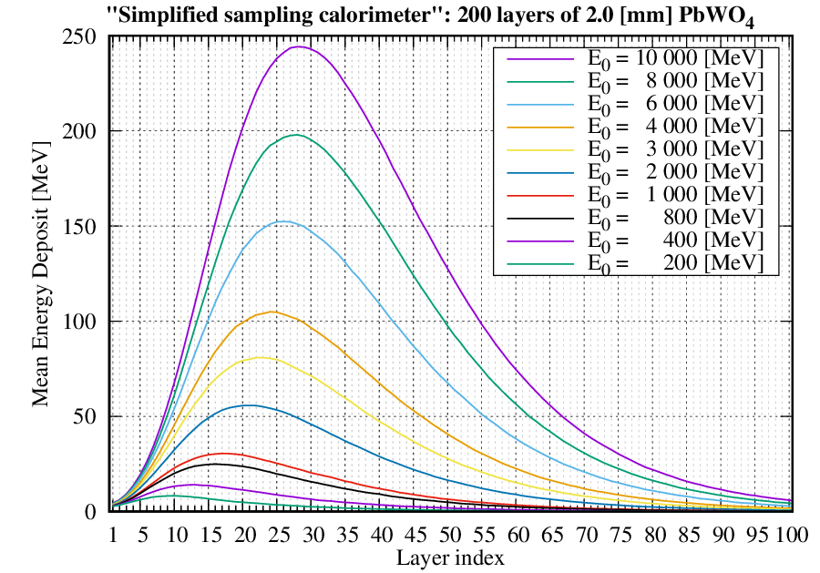

.. _simulation_components_doc:

The components of the simulation
=================================

The two main components of the simulation are the `Geometry`_ and `Physics`_ providing information and functionalities required to compute the individual simulation steps during the `Event processing`_ inside the `Stepping loop`_.
The information is fused together in order to calculate how far the particle goes in a given step and what happens with it both along its way to and at the corresponding post-step point.

The `Geometry`_ describes the simulation setup, including navigation possibilities or providing information on the **geometrical constraints for
the simulation step computation** (e.g. given a global point, how far the nearest volume boundary is or how far the volume boundary to a given
direction is, etc.). The `Physics`_ component is responsible to supply the **physics related constraints for the simulation step computation**
(e.g. how far the given particle go till its next interaction of the given type or how far a charge particle goes till it loses all its current
energy, etc.). These constraints are required during the `Event processing`_ at the beginning of each simulation step computation in the
`Stepping loop`_ to decide length of the simulation step. The particle is then moved to the post-step point and the necessary `Geometry`_
and/or `Physics`_ related **actions are performed** on the particle. Some information regarding the given simulation step, e.g. energy deposit,
might be collected at the end of each simulation step before performing the computation of the next step till the history of the particle is
terminated (e.g. :math:`e^-` lost all its kinetic energy in the last step; :math:`\gamma` was absorbed in photoelectric process or destructed by
producing :math:`e^-/e^+` pair, etc.).

While the above components perform the event processing, the smaller `Primary generator`_ simulation component is used to generate primary particle track(s)
at the beginning of each event. Further, auxiliary components, like the `Input arguments`_ or the `Results`_ are also added to complete the simulation
by providing configuration options and the possibility of collecting some (even more) application specific data during the simulation.

A short description of these components is provided in this section together with the `The HepEmShow application main`_.

.. _geometry_doc:

Geometry
---------

The application :cpp:class:`Geometry` is a configurable simplified sampling ``calorimeter`` that is built up from ``N`` ``layer``-s of an ``absorber`` and
a ``gap`` as illustrated in :numref:`fig_calo_layer2`.

.. _fig_calo_layer2:

   Illustration of the default ``absorber`` (green) and ``gap`` (blue) ``layer`` structured simplified sampling calorimeter configuration (with ``N = 14`` ``layer``-s in this case).
   The red arrow from left represents the direction of the incoming primary particle beam.

The number of ``layer``-s ``N``, the thickness of both the ``absorber`` and ``gap`` can be set at the construction of the calorimeter
(see the `Input arguments`_ of `The HepEmShow application main`_). All thicknesses are measured along the ``x``-axis in ``mm`` units.

.. note:: The ``gap`` thickness can be set even to zero in which case the ``calorimeter`` is built up from the given number of ``layer``-s of
   ``absorber`` with the given thickness (i.e. a single material calorimeter sliced by the ``layer``-s) as illustrated in :numref:`fig_calo_layer1`.

   .. _fig_calo_layer1:
   .. figure:: figs/calo_layer1.png
      :name: geom-calo_layer1
      :scale: 100 %
      :align: center
      :alt: geom-calo_layer1

      Illustration of the single material calorimeter sliced by the ``layer``-s (``N = 18``). As the ``gap`` thickness is set to ``0``, the
      single ``layer`` thickness is identical to the ``absorber`` (blue) thickness while the ``calorimeter`` thickness is :math:`\times` ``N`` of that.

The thickness of the single ``layer`` as well as the entire ``calorimeter`` is automatically computed from the given ``absorber``, ``gap``
thicknesses and number of ``layer``-s respectively. The transverse size, i.e. the full extent of the ``absorber``, ``gap``, ``layer``
and the ``calorimeter`` along the ``y``- and ``z``-axes, can also be set as an input argument (see the `Input arguments`_ of
`The HepEmShow application main`_). The calorimeter is places in the center of the ``world`` so 5 (:cpp:class:`Box` shaped) volumes are
used in total to describe the application geometry. The size of the ``world`` volume is computed automatically based on the extent of the
calorimeter such that it encloses the entire calorimeter with some margin.

.. note:: The ``x``-coordinate of the left hand side boundary of the calorimeter as well as an appropriate
   initial ``x``-coordinate of the primary particles (such that they are located mid-way between the ``calorimeter`` and
   the ``world`` boundaries along the negative ``x``-axis) are calculated. At the beginning of an event, the
   :cpp:class:`PrimaryGenerator` will generate primary particles at this later position with the ``[1,0,0]`` direction vector,
   i.e. pointing toward to the left hand side boundary of the calorimeter. Each primary particle is then moved to the former position,
   i.e. on the left hand side boundary of the calorimeter, in their very first step such that they will enter into the calorimeter
   in the next, second simulation step.

Each of these volumes is filled with a given material specified by the material index of the volume. These indices are the subscripts of the
(``Geant4`` predefined NIST) materials listed in the material name vector of `The HepEmShow-DataGeneration application main`_. In the default case, which is the same that
was used to generate the ``G4HepEm`` data shipped with the application, this material name vector is

.. code-block:: cpp
   :caption: The material name vector as it is in `The HepEmShow-DataGeneration application main`_.

   // list of Geant4 (NIST) material names
   std::vector<std::string> matList {"G4_Galactic", "G4_PbWO4", "G4_lAr"};

This corresponds to the default `index-to-material` and eventually to the `material-to-volume` association shown
in :numref:`table_material_index`. A complete list of the predefined NIST materials provided by ``Geant4`` with their composition
can be found at the corresponding part of the ``Geant4`` `documentation (Book For Application Developers: Geant4 Material Database) <https://geant4-userdoc.web.cern.ch/UsersGuides/ForApplicationDeveloper/html/Appendix/materialNames.html>`_.

.. table:: The default material to index and material to volume association.
   :name: table_material_index

   +-------------------+-----------+----------------+
   | Material          |  Index    | Used in Volume |
   +===================+===========+================+
   | `galactic`        |    0      | ``layer``      |
   | (low density gas) |           | ``calorimeter``|
   |                   |           | ``world``      |
   +-------------------+-----------+----------------+
   | lead tungstate    |    1      |   ``absorber`` |
   | (atolzite)        |           |                |
   +-------------------+-----------+----------------+
   | liquid-argon      |    2      |   ``gap``      |
   +-------------------+-----------+----------------+

.. note:: Changing the material name(s) in this above vector of the `The HepEmShow-DataGeneration application main`_ (especially at index ``1``
   and/or ``2`` as the vacuum is always needed to fill the ``layer``, ``calorimeter`` and ``world`` container volumes), regenerating the data
   by executing this data generation application, then executing again the ``HepEmShow`` application, corresponds to changing the material
   of the ``absorber`` and/or ``gap`` volumes of the simulation.

The application geometry also provides a rather simple "navigation" capability (used in the simulation stepping loops) through its :cpp:func:`Geometry::CalculateDistanceToOut()` method
described in details at the corresponding code documentation.

.. attention:: Unlike the ``Geant4`` geometry modeller and navigation, that provides generic geometry description and navigation capabilities,
   the :cpp:class:`Geometry` implemented for ``HepEmShow`` is specific to the configurable simplified sampling calorimeter described above. Focusing
   only to this specific geometry modelling and related navigation problem made possible to provide a rather compact, simple and clear implementation
   of all geometry related functionalities required during the simulation (i.e. in the :cpp:class:`SteppingLoop`).

.. physics_doc:

Physics
----------------------

Targeting only the simulation of the EM shower inherently leads to a compact simulation as it includes only :math:`e^-/e^+` and :math:`\gamma`
particles with their EM (i.e. without gamma- and lepto-nuclear) interactions. Focusing to the descriptions of these interactions, that ensures
sufficient details and accuracy for HEP detector simulations, leads to an even more specific set of interactions and underlying models that
the physics component of the simulation needs to provide. This well defined, important but small subset of the very rich physics offered by
the ``Geant4`` toolkit, can then be implemented in a very compact form.

The ``G4HepEm`` R&D project :cite:`g4hepem` offers such an implementation with several attractive properties. Separation of data definition,
initialisation and run-time functionalities results in a rather small, ``Geant4`` independent, stateless, header based implementation of all
physics related run-time functionalities required for such EM shower simulations. Furthermore, all the data, extracted from ``Geant4`` during
the initialisation, can be exported/imported into/from a single file making possible to skip the ``Geant4`` dependent initialisation phase
in subsequent executions of the application. Therefore, ``G4HepEm`` offers the possibility of a ``Geant4`` like but ``Geant4``
independent EM physics component for developing particle transport simulations. Further information on ``G4HepEm``, including the
`physics interactions included <https://g4hepem.readthedocs.io/en/latest/IntroAndInstall/introduction.html#physics-modelling-capability>`_,
can be found in the corresponding part of the ``G4HepEm`` `documentation <https://g4hepem.readthedocs.io/en/latest/>`_.

.. note:: The ``hepemshow`` repository includes the pre-generated data file (``/data/hepem_data.json``) that has been extracted by using the
   ``HepEmShow-DataGeneration`` with the default material configuration settings. Providing this data file makes possible
   to initialise the ``G4HepEm`` data component from this file making ``HepEmShow`` independent from ``Geant4``. The ``HepEmShow-DataGeneration``
   application is also available in the ``hepemshow`` repository. This can be used to re-generate the above data file when the goal is to change
   the default material configuration (see above at the `Geometry`_ section). However, as the data extraction requires the ``Geant4`` dependent
   initialisation of ``G4HepEm``, it requires a ``Geant4`` dependent build of ``G4HepEm``. See more details in the :ref:`Build and Install <install_doc>` section.

As mentioned above, the entire physics of the ``HepEmShow`` simulation application is provided by ``G4HepEm`` :cite:`g4hepem`. The required,
definitions (``.hh`` files) of the ``G4HepEm`` run-time functionalities are pulled in by the ``Physics.hh`` header while the corresponding
implementations (``.icc`` files) are in the ``Physics.cc``. The only missing implementation, that the client needs to provide, is a uniform
random number generator that needs to be utilised to complete the implementation of the ``G4HepEmRandomEngine``. This is also done in the
``Physics.cc`` file by using the local :cpp:class:`URandom` uniform random number generator. More information can be found in the code
documentation of the :cpp:class:`Physics`.

``G4HepEm`` provides two top level methods, ``HowFar`` and ``Perform`` in its ``G4HepEmGammaManager`` and ``G4HepEmElectronManager`` for :math:`\gamma` and :math:`e^-/e^+` particles respectively:

  * ``HowFar``: the physics constrained step length of the given input track, i.e. how far the particle goes e.g. till the next physics
    interaction takes place or it loses all its kinetic energy or due to any other physics related constraints.

  * ``Perform``: performs all necessary physics related actions and updates on the given input track, including the production of secondary
    tracks in the given physics interaction (if any).

These two top level methods are utilised in the `Stepping loop`_ during the computation of the individual simulation step. ``HowFar`` is invoked
at the pre-step point, i.e. at the step limit evaluation, while ``Perform`` is utilised at the post-step point of each individual simulation step
computation inside the :cpp:func:`SteppingLoop::GammaStepper()` and :cpp:func:`SteppingLoop::ElectronStepper()` methods.

.. attention:: Unlike the `Geometry`_ of the application, the `Physics`_ is fully generic as ``G4HepEm`` provides an application independent, generic
   EM physics component similarly to the corresponding native ``Geant4`` implementation. However, the ``Geant4`` dependent initialisation
   phase of ``G4HepEm``, i.e. the data extraction, has been eliminated from ``HepEmShow`` by separating it to the additional ``HepEmShow-DataGeneration``
   application in order to make ``HepEmShow`` independent from ``Geant4``. As a consequence, the corresponding generated data file is specific to a given
   material configuration and needs to be re-generated whenever one would like to change that material configuration as discussed above.

Primary generator
-------------------

The primary generator is used to:

 - store the properties of the primary particle track
 - generate such primary particle tracks to initiate a new event

The properties of the primary generator can be set by providing the appropriate `Input arguments`_ when executing the ``HepEmShow`` simulation application. The :cpp:func:`PrimaryGenerator::GenerateOne`
method is invoked then from the `Event loop`_ at the beginning of each event to generate a primary particle track.

.. note:: An event is assumed to be composed form a single primary particle track but only for simplicity as most of the event processing would work fine with more than one primary tracks as well.

Event processing
----------------------

After reading the `Input arguments`_ and setting up the `Physics`_, `Geometry`_ and `Primary generator`_ components accordingly, the ``HepEmShow`` simulation is ready
for event processing. The event processing consists of an outer `Event loop`_, a small intermediate tracking loop and the innermost `Stepping loop`_.

The `Event loop`_ is running over the individual events and responsible for generating and initialising a track stack with the corresponding primary particle track.
The intermediate small tracking loop just takes the next track from this stack and invokes the appropriate `Stepping loop`_. The entire history of the inserted track
is simulated then by this innermost loop, including generation of secondary particle tracks (also inserted into the track stack for later tracking), in a step-by-step way.

The simulation of a particle history is terminated when the particle kinetic energy goes to zero, undergoes a destructive interaction or simple leaves the simulation setup.
As long as the stack is not empty, a new track is taken and its history is simulated similarly while the simulation of the actual event is completed otherwise. As long as
the number of simulated events is less than the required, a new event is generated and its processing starts similarly while the simulation is completed otherwise.

Event loop
^^^^^^^^^^^^^

The event loop is responsible for the generation and simulation of the required number of primary events.

At the beginning of each event, the `Primary generator`_ is invoked to produce the actual event, i.e. the primary particle track (one primary per event for simplicity)
that belong to the actual event. The generated primary track is inserted/pushed into the :cpp:class:`TrackStack` as the very first track and the simulation of the
event starts. During the simulation of the event:

  - one track is popped from the stack
  - inserted in the appropriate `Stepping loop`_ to simulate its entire history in a step-by-step way (see below)

At the end of each simulation step, secondary tracks that are created in that step in the related physics interaction (if any), are inserted/pushed into the :cpp:class:`TrackStack`.
At the beginning of a typical EM shower, the :cpp:class:`TrackStack` is growing as usually more than one secondary is created per history. This will start to shrink then when
popping up more and more low energy particles that do not produce any secondaries in their history. The simulation of the event is then completed when the :cpp:class:`TrackStack` becomes empty again.
A new event might be generated at this point till the requested number of simulated event is reached when the simulation terminates.

In order to provide the possibility of interacting with the simulation at the event and stacking level, e.g. for collecting some information during the event processing or stacking,
the :cpp:func:`EventLoop::BeginOfEventAction()` / :cpp:func:`EventLoop::EndOfEventAction()` methods are invoked before/after each event processing while the
:cpp:func:`EventLoop::BeginOfTrackingAction()` / :cpp:func:`EventLoop::EndOfTrackingAction()` methods are invoked before/after tracking each new track.

A typical task that is done at the beginning of a new event is to clear/reset some variables that will be used then during the processing of the event to accumulate information like the *total energy deposited
during the given event in the absorber*. At the end of the event, the collected information might be stored at or added to a higher, i.e. entire simulation, level. A typical task that can be done at the
beginning of tracking is to inspect the properties of a particle before inserting to the `Stepping loop`_. Moreover, even the behaviour can be changed by altering some of the particle properties, e.g. setting
its kinetic energy to zero discards the particle from tracking as the `Stepping loop`_ terminates immediately.

More details can be found by inspecting the implementation of the :cpp:func:`EventLoop::EventProcessing` method.

Stepping loop
^^^^^^^^^^^^^^

Stepping loops can calculate a given :math:`\gamma` (:cpp:func:`SteppingLoop::GammaStepper`) or :math:`e^-/e^+` (:cpp:func:`SteppingLoop::ElectronStepper`)
particle simulation history from the initial state of the particle track, i.e. as inserted from the `Event loop`_, till the end in a step-by-step way. At each step:

  - the actual step length is calculated, accounting both the `Geometry`_ and the `Physics`_ related constraints
  - the track is moved to its post-step position
  - all physics related actions, happening along and/or at the post-step point, are performed on the track
  - secondary tracks, generated in the given step by a physics interaction (if any), are inserted into the track stack

In order to provide the possibility of interacting with the simulation at the end of each simulation step, the :cpp:func:`SteppingLoop::SteppingAction()` method is invoked. This can be used to e.g. obtain information
on the energy deposited in the given simulation step.

The particle simulation history is terminated when either:

  - the particle kinetic energy becomes zero (e.g. an :math:`e^-` lost all its kinetic energy in its last step)
  - the particle participated in a destructive interaction (e.g. photoelectric absorption of a :math:`\gamma` photon or conversion to :math:`e^-/e^+` pairs)
  - the particle leaves the calorimeter (in a normal ``Geant4`` simulation this would happen when the particle leaves the world but in our case that would be just one more step in vacuum)

More details can be found by inspecting the implementation of the :cpp:func:`SteppingLoop::GammaStepper` and :cpp:func:`SteppingLoop::ElectronStepper` methods.

.. attention:: The event processing algorithm, including both the `Event loop`_ and `Stepping loop`_, is general, i.e. not application specific as long as the geometry related methods
   provide the expected behaviour. However, the event, tracking and stepping actions are rather specific to the (implemented simplified sampling calorimeter) simulation
   application as they implement the application specific information extraction. This is exactly the same with a pure ``Geant4`` simulation application as the corresponding user actions
   are implemented for and thus specific to a given simulation application while the entire event processing loop is part of the generic, internal ``Geant4`` simulation kernel.

Additional components
----------------------

While `Geometry`_, `Physics`_, `Primary generator`_ and the `Event processing`_ are essential components of any simulations, the additional `Input arguments`_ and `Results`_ are used to provide
configuration options to them and the possibility of collecting some (even more) application specific data during the simulation respectively.

Input arguments
^^^^^^^^^^^^^^^^^^^

The :cpp:class:`InputParameters` can be used to set some `Geometry`_, `Physics`_, `Primary generator`_ and `Event processing`_ related parameters of the ``HepEmShow`` simulation application.
The configurable parameters, with their default values, are reported when executing the simulation application as::

     $ ./HepEmShow --help

     === Usage: HepEmShow [OPTIONS]

    	-l  --number-of-layers      (number of layers in the calorimeter)           - default: 50
    	-a  --absorber-thickness    (in [mm] units)                                 - default: 2.3
    	-g  --gap-thickness         (in [mm] units)                                 - default: 5.7
    	-t  --transverse-size       (of the calorimeter in [mm] units)              - default: 400
    	-p  --primary-particle      (possible particle names: e-, e+ and gamma)     - default: e-
    	-e  --primary-energy        (in [MeV] units)                                - default: 10 000
    	-n  --number-of-events      (number of primary events to simulate)          - default: 1000
    	-s  --random-seed                                                           - default: 1234
    	-d  --g4hepem-data-file     (the pre-generated data file with its path)     - default: ../data/hepem_data
    	-v  --run-verbosity         (verbosity of run information: nothing when 0)  - default: 1
    	-h  --help

or with the actual values when executing a simulation application as::

  $ ./HepEmShow  --number-of-layers 42  --primary-energy 200

    === HepEmShow input parameters:
        --- Geometry configuration:
            - number-of-layers      : 42
            - absorber-thickness    : 2.3 [mm]
            - gap-thickness         : 5.7 [mm]
            - transverse-size       : 400 [mm]
        --- Primary and Event configuration:
            - primary-particle      : e-
            - primary-energy        : 200 [MeV]
            - number-of-events      : 1000
            - random-seed           : 1234
        --- Additional configuration:
            - g4hepem-data-file    : ../data/hepem_data.json
            - run-verbosity        : 1
    --- EventLoop::ProcessEvents: starts simulation of N = 1000 events...

Results
^^^^^^^^^^^^^

:cpp:class:`Results` is a simply data structure that can be used to collect information during the event processing. These information can be updated in the provided action methods that offer
the possibility of interacting with the simulation at the different point of the event processing (outer, immediate and inner loops):

  - event: :cpp:func:`EventLoop::BeginOfEventAction()` / :cpp:func:`EventLoop::EndOfEventAction()` invoked before/after processing and event
  - tracking: :cpp:func:`EventLoop::BeginOfTrackingAction()` / :cpp:func:`EventLoop::EndOfTrackingAction()` invoked before/after simulating the history of a track
  - stepping: :cpp:func:`SteppingLoop::SteppingAction()` invoked after each individual simulation steps

The :cpp:class:`Results` data structure is used to collect the following information during the event processing (by default):

   - mean values of energy deposit, neutral (gamma) and charged (electron/positron) particle track length per event in the individual calorimeter layers
   - mean number of energy deposited in the ``absorber`` and ``gap`` materials per event
   - mean number of secondary gamma, electron and positrons produced per event
   - mean number of neutral (gamma) and charged (electron/positron) steps pre event

Quantities, recorded in the individual layers are stored in histograms and written to files at the end of the simulation (see some `Examples`_ below) while
others are reported by printing to the standard output as (default run)::

        --- Results::WriteResults ----------------------------------

        Absorber: mean Edep = 6722.95 [MeV] and  Std-dev = 309.636 [MeV]
        Gap     : mean Edep = 2571.75 [MeV] and  Std-dev = 118.507 [MeV]

        Mean number of gamma       4457.043
        Mean number of e-          7957.899
        Mean number of e+          428.922

        Mean number of e-/e+ steps 36097
        Mean number of gamma steps 40436.2
        ------------------------------------------------------------

The ``HepEmShow`` application main
-------------------------------------

The above simulation components are fused together in the ``HepEmShow`` main function to form the corresponding simulation application with the following steps:

  * reads the `Input arguments`_, provided at the execution of the application, that determines the actual configuration
  * `Physics`_ and the underlying ``G4HepEm`` related configuration steps:

    - initialising ``G4HepEm`` by loading the corresponding data and parameters from the pre-generated state file (can be set by the ``--g4hepem-data-file`` input argument)
    - constructs the additional ``G4HepEmTLData`` that encapsulates the (application local, uniform :cpp:class:`URandom` based) random number generator as well as some track buffers. This is used in all information exchange between
      the underlying ``G4HepEm`` implementation of the physics and the simulation application

  * constructs and sets up the application `Geometry`_ according to the provided related input arguments
  * constructs and sets up the `Primary generator`_ of the application according to the provided related input arguments
  * constructs and sets up a `Results`_ structure that will be used to collect some data during the simulation
  * the `Event processing`_ is invoked then by calling the :cpp:func:`EventLoop::ProcessEvents` method with the provided related input arguments to perform the simulation
  * when completing the event processing, the simulation `Results`_  are written to files (histograms) and reported on the standard output when invoking :cpp:func:`WriteResults()`

Examples
^^^^^^^^

**1. Simulation results compared to a** ``Geant4`` **simulation**:

The simplified sampling calorimeter application, implemented in ``HepEmShow`` can be found in the ``G4HepEm`` repository :cite:`g4hepem` as an example implemented as a ``Geant4`` simulation application.
This offers the possibility to compare the ``Geant4`` independent ``HepEmShow`` simulation results to those obtained by the corresponding ``Geant4`` based version of the simulation.

The default simulation configuration was used in this example with the only difference that the number of required events was set to :math:`10^7` in order to reduce the statistical uncertainty.
:math:`\texttt{TestEm3}`, the ``Geant4`` based version `as taken from the G4HepEm repository <https://github.com/mnovak42/g4hepem/tree/master/apps/examples/TestEm3>`_, was used by setting the
geometry configuration identical to the default ``HepEmShow`` geometry. The physics component of the ``Geant4`` based simulation was chosen to be the same as used in ``HepEmShow`` (i.e. ``G4HepEm``).
While ``G4HepEm`` can reproduce the corresponding native, ``Geant4`` physics based results with an excellent precision (relative error within per mille), this setting ensures that only the
``HepEmShow`` locally implemented components (i.e. `Geometry`_, `Event processing`_, etc. everything than `Physics`_) are different.

The mean energy deposit, obtained by using the default configuration of the ``Geant4`` independent ``HepEmShow`` simulation, is compared to the corresponding result produced by the above-mentioned
``Geant4`` based version of the application in :numref:`fig_edep-hepemshow-vs-g4` while the other observables are reported in :numref:`ex1-table-1`. An excellent agreement can be seen that
verifies the correct behaviour of all ``HepEmShow`` locally implemented components. It must be noted, that the somewhat larger (but still rather small) difference observed in the mean number of
:math:`e^-/e^+` steps is the effect of the slightly different multiple Coulomb scattering contribution to step limit (due to some difference in the geometry/navigation).

.. _fig_edep-hepemshow-vs-g4:

   Comparison of the mean energy, deposited in the individual calorimeter layers, obtained by ``HepEmShow`` and the corresponding ``Geant4`` based implementation of the same application.

.. table:: Summary of the simulation results obtained by ``HepEmShow`` and the corresponding ``Geant4`` based implementation of the same application. The reported mean energy deposited in
           the ``absorber``/``gap`` materials, mean number of produced secondaries as well as charged (i.e. :math:`e^-/e^+`) and neutral (i.e. :math:`\gamma`) simulation steps per event
           are in an excellent agreement.
   :name: ex1-table-1

   +---------------------------------------------------------------+--------------------------+----------------------------+----------------+
   |                                                               | :math:`\texttt{Geant4}`  | :math:`\texttt{HepEmShow}` | rel. error [%] |
   +=====================================+=========================+==========================+============================+================+
   |                                     | :math:`\texttt{PbWO}_4` |  6726.72                 |  6726.78                   | -0.00089       |
   | :math:`\text{E}_{\text{dep}}` [MeV] +-------------------------+--------------------------+----------------------------+----------------+
   |                                     | :math:`\texttt{lAr}`    |  2568.84                 |  2568.89                   | -0.00195       |
   +-------------------------------------+-------------------------+--------------------------+----------------------------+----------------+
   |                                     | :math:`\gamma`          |  4458.02                 |  4458.02                   |  0             |
   |                                     +-------------------------+--------------------------+----------------------------+----------------+
   | #secondaries                        | :math:`e^-`             |  7961.90                 |  7962.06                   |  -0.002        |
   |                                     +-------------------------+--------------------------+----------------------------+----------------+
   |                                     | :math:`e^+`             |   429.309                |   429.314                  |  -0.0011       |
   +-------------------------------------+-------------------------+--------------------------+----------------------------+----------------+
   |                                     | :math:`\texttt{charged}`|  36238.1                 | 36103.4                    |   0.3717       |
   | #steps                              +-------------------------+--------------------------+----------------------------+----------------+
   |                                     | :math:`\texttt{neutral}`|  40458.4                 | 40458.2                    |  0.00049       |
   +-------------------------------------+-------------------------+--------------------------+----------------------------+----------------+

**2. Simulation results obtained with different configurations**:

:numref:`fig_edep-hepemshow-8mm` shows mean energy deposits (per event, as a function of the calorimeter layer index, i.e. depth) obtained by running the
``HepEmShow`` simulation  with different ``absorber`` and ``gap`` thicknesses using the default :math:`E_0 = 10` [GeV] :math:`e^-` primary particles.

.. _fig_edep-hepemshow-8mm:

   Variation of the mean energy deposit when changing the ``absorber`` and ``gap`` thickness of the layers such that the layer thickness as well as all other configurations
   are kept constants. The default :math:`E_0 = 10` [GeV] :math:`e^-` were used as primary events.

As an example, the result that corresponds to the 4.0 [mm] ``absorber`` (:math:`\texttt{PbWO}_4`) and 4.0 [mm] ``gap`` (:math:`\texttt{lAr}`) thickness run in :numref:`fig_edep-hepemshow-8mm`
can be obtained by executing ``HepEmShow`` with the following parameters (all others stays default)::

  $ ./HepEmShow \
    --absorber-thickness 4.0 \
    --gap-thickness 4.0

The results shown in :numref:`fig_edep-hepemshow-edep` were obtained by setting a 2.0 [mm] thickness for the ``absorber`` while zero for the ``gap``. This corresponds to a `Geometry`_
of a single (:math:`\texttt{PbWO}_{4}`) material sliced by 2.0 [mm] layers along the primary particle direction (see more at the `Geometry`_). The number of layers was set to 200 and
the results, obtained by varying the primary particle (:math:`e^-`) energy between :math:`E_0 = [0.2 - 10]` [GeV], are shown.

:numref:`fig_edep-hepemshow-edep` shows mean energy deposits (per event, as a function of the calorimeter layer index, i.e. depth) obtained by running the
``HepEmShow`` simulation  with different ``absorber`` and ``gap`` thicknesses using the default :math:`E_0 = [0.2 - 10]` [GeV] :math:`e^-` primary particles.

.. _fig_edep-hepemshow-edep:

   Variation of the mean energy deposit, as a function of the depth (with a resolution/bin-with of 2.0 [mm]), when changing the primary particle (:math:`e^-`) energy.

As an example, the result that corresponds to the :math:`E_0 = 2.0` [GeV] run in :numref:`fig_edep-hepemshow-edep` can be obtained by executing ``HepEmShow`` with the
following parameters (all others stays default)::

  $ ./HepEmShow \
    --absorber-thickness 2.0 \
    --gap-thickness 0 \
    --number-of-layers 200 \
    --primary-energy 2000

The ``HepEmShow-DataGeneration`` application main
---------------------------------------------------

The physics of the ``HepEmShow`` simulation application is provided by ``G4HepEm``. As mentioned at the `Physics`_, `Geometry`_ or even in the `Details <instal_details_doc>`_
subsection of the :ref:`Build and Install <install_doc>` sections, the ``Geant4`` dependent initialisation part of ``G4HepEm`` is well separated from the rest. Furthermore, the
already initialised state of ``G4HepEm``, that depends on the material (and production cut) configuration of the application in hand, can be exported to a state file and
``G4HepEm`` can then be re-initialised solely from such a state file skipping the ``Geant4`` dependent initialisation part. This is how ``G4HepEm`` provides a ``Geant4``
independent physics component for EM shower simulations exploited in ``HepEmShow``.

However, as the physics depends on the material (and secondary production threshold) configuration of the application geometry, a given state file corresponds to a given
material (and cut) configuration of the application. The ``G4HepEm`` state file that corresponds to the default material configuration of the `Geometry`_ is available
in the repository in order to be able to use the ``HepEmShow`` simulation application without ``Geant4`` (but only with the default material configuration).
The auxiliary ``HepEmShow-DataGeneration`` application, that was used to generate the ``G4HepEm`` state file, is also available for providing the possibility of changing this
default material configuration (see :numref:`table_material_index`) by generating new ``G4HepEm`` state files that correspond to different material configurations.

It must be noted though, that this ``HepEmShow-DataGeneration`` application requires both a ``Geant4`` and a complete, ``Geant4`` dependent build of ``G4HepEm`` installed on the
system as both the application itself and the initialisation of ``G4HepEm`` (i.e. producing the state) depend on ``Geant4`` (see more at the :ref:`Build and Install <install_doc>` sections).

The ``HepEmShow-DataGeneration`` application:

 - builds and pre-initialises a ``Geant4`` geometry with the given list of materials (and secondary production threshold value) to be ready for the physics initialisation
 - initialises ``G4HepEm`` according to the geometry (material cut) configuration
 - exports the already initialised ``G4HepEm`` state to a file

The required materials are given as a vector of pre-defined ``Geant4`` material names in the ``HepEmShow-DataGeneration`` application main. The material at index 1 corresponds to
the ``absorber`` while the one at index 2 to the ``gap`` materials of the ``HepEmShow`` simulation application geometry. Therefore:

 - by editing the pre-defined ``Geant4`` material name given in the ``HepEmShow-DataGeneration`` application main (the default is)::

       // list of Geant4 (NIST) material names
       std::vector<std::string> matList {"G4_Galactic", "G4_PbWO4", "G4_lAr"};

 - building and executing the modified application generates a new data file (by default ``../data/hepem_data`` but can be changed as well)
 - executing then the ``HepEmShow`` application with the newly generated ``G4HepEm`` state file

result in a simulation with the new material configuration.

Example
^^^^^^^^

Using the ``HepEmShow`` simulation now with :math:`\texttt{silicon}` as ``absorber`` material instead of the default :math:`\texttt{PbWO}_4` can be done by:

 - editing the material name vector (and state file name), i.e. changing from the default::

     // list of Geant4 (NIST) material names (change the listed material names and regenerate the data)
     std::vector<std::string> matList {"G4_Galactic", "G4_PbWO4", "G4_lAr"};

     // output, i.e. the G4HepEm data, file name (change the file mane and regenerate the data)
     const G4String fileName    = "../data/hepem_data";

   to::

     // list of Geant4 (NIST) material names (change the listed material names and regenerate the data)
     std::vector<std::string> matList {"G4_Galactic", "G4_Si", "G4_lAr"};

     // output, i.e. the G4HepEm data, file name (change the file mane and regenerate the data)
     const G4String fileName    = "../data/hepem_data-Si";

 - building and executing the modified ``HepEmShow-DataGeneration`` application generates a new data file: ``../data/hepem_data-Si``::

    $ ./HepEmShow-DataGeneration

    ========= Table of registered couples ============================

    Index : 0     used in the geometry : Yes
     Material : G4_Galactic
     Range cuts        :  gamma  700 um     e-  700 um     e+  700 um  proton 700 um
     Energy thresholds :  gamma  1 keV    e-  1 keV    e+  1 keV proton 70 keV
     Region(s) which use this couple :
        Det-Region

    Index : 1     used in the geometry : Yes
     Material : G4_Si
     Range cuts        :  gamma  700 um     e-  700 um     e+  700 um  proton 700 um
     Energy thresholds :  gamma  5.85422 keV    e-  423.34 keV    e+  409.007 keV proton 70 keV
     Region(s) which use this couple :
        Det-Region

    Index : 2     used in the geometry : Yes
     Material : G4_lAr
     Range cuts        :  gamma  700 um     e-  700 um     e+  700 um  proton 700 um
     Energy thresholds :  gamma  5.20429 keV    e-  273.968 keV    e+  266.185 keV proton 70 keV
     Region(s) which use this couple :
        Det-Region

    ==================================================================

     === G4HepEm global init ...
     === G4HepEm init for particle index = 0 ...
         ---  InitElectronData ...
         ---  BuildELossTables ...
         ---  BuildLambdaTables ...
         ---  BuildTransportXSectionTables ...
         ---  BuildElementSelectorTables ...
         ---  BuildSBBremTables ...
     === G4HepEm init for particle index = 1 ...
         ---  InitElectronData ...
         ---  BuildELossTables ...
         ---  BuildLambdaTables ...
         ---  BuildTransportXSectionTables ...
         ---  BuildElementSelectorTables ...
     === G4HepEm init for particle index = 2 ...
         ---  InitGammaData ...
         ---  BuildLambdaTables ...
         ---  BuildElementSelectorTables ...

 - then executing the ``HepEmShow`` simulation application with the newly generated ``../data/hepem_data-Si`` ``G4HepEm`` state file as::

    $ ./HepEmShow --g4hepem-data-file ../data/hepem_data-Si

      === HepEmShow input parameters:
          --- Geometry configuration:
              - number-of-layers      : 50
              - absorber-thickness    : 2.3 [mm]
              - gap-thickness         : 5.7 [mm]
              - transverse-size       : 400 [mm]
          --- Primary and Event configuration:
              - primary-particle      : e-
              - primary-energy        : 10000 [MeV]
              - number-of-events      : 1000
              - random-seed           : 1234
          --- Additional configuration:
              - g4hepem-data-file    : ../data/hepem_data-Si.json
              - run-verbosity        : 1
      --- EventLoop::ProcessEvents: starts simulation of N = 1000 events...
           - starts processing #event = 100
           - starts processing #event = 200
           - starts processing #event = 300
           - starts processing #event = 400
           - starts processing #event = 500
           - starts processing #event = 600
           - starts processing #event = 700
           - starts processing #event = 800
           - starts processing #event = 900
           - starts processing #event = 1000
      --- EventLoop::ProcessEvents: completed simulation within t = 5.62393 [s]

      --- Results::WriteResults ----------------------------------
      Absorber: mean Edep = 594.48 [MeV] and  Std-dev = 225.806 [MeV]
      Gap     : mean Edep = 837.006 [MeV] and  Std-dev = 316.342 [MeV]

      Mean number of gamma       498.554
      Mean number of e-          1173.554
      Mean number of e+          30.738

      Mean number of e-/e+ steps 5367.38
      Mean number of gamma steps 9937.19
      ------------------------------------------------------------

produces rather different results compared to the default material configuration.
